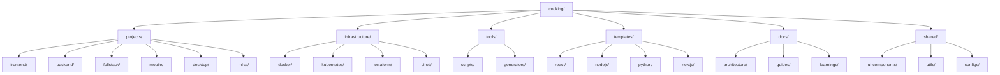

# Cooking - Personal Projects Repository

A personal repository for learning and practicing software architecture skills across multiple tech stacks.

## Repository Structure



### Detailed Structure

```
cooking/
├── projects/           # Main projects
│   ├── frontend/      # Frontend projects
│   ├── backend/       # Backend projects
│   ├── fullstack/     # Fullstack projects
│   ├── mobile/        # Mobile apps
│   ├── desktop/       # Desktop applications
│   └── ml-ai/         # Machine Learning & AI projects
├── infrastructure/     # Infrastructure as Code
│   ├── docker/        # Docker configurations
│   ├── kubernetes/    # K8s manifests
│   ├── terraform/     # Infrastructure provisioning
│   └── ci-cd/         # CI/CD pipelines
├── tools/             # Shared tools & scripts
│   ├── scripts/       # Utility scripts
│   └── generators/    # Code generators
├── templates/         # Project templates
│   ├── react/         # React template
│   ├── nodejs/        # Node.js template
│   ├── python/        # Python template
│   └── docker/        # Docker template
├── docs/              # Documentation
│   ├── architecture/  # Architecture decisions
│   ├── guides/        # How-to guides
│   └── learnings/     # Notes & learnings
└── shared/            # Shared libraries & packages
    ├── ui-components/ # Shared UI components
    ├── utils/         # Utility functions
    └── configs/       # Shared configurations
```

## Goals

- **Learning**: Practice patterns and best practices
- **Architecture**: Develop system design skills
- **Diversity**: Experience various technologies and stacks
- **Reusability**: Build reusable libraries and tools

## Getting Started

### Quick Start

```bash
# 1. Setup environment
make setup

# 2. Create a new project
make new-project NAME=my-first-project TEMPLATE=react

# 3. Or use the script directly
./tools/scripts/create-project.sh my-project react

# 4. Navigate to the project directory and start coding
cd projects/frontend/my-project
npm install
npm run dev
```

### Create a New Project

```bash
# Using Makefile (recommended)
make new-project NAME=my-project TEMPLATE=react

# Or use the script directly
./tools/scripts/create-project.sh <project-name> <template-type>

# Available templates: react, nextjs, nodejs, python
```

### Run a Project

Each project has its own README with specific instructions. See the [Development Guide](./docs/guides/development.md) for more details.

## Documentation

### Guides

- [Development Guide](./docs/guides/development.md) - Development workflow
- [Project Structure Guide](./docs/guides/project-structure.md) - Project structure
- [Deployment Guide](./docs/guides/deployment.md) - Deployment instructions

### Architecture

- [Architecture Decisions](./docs/architecture/README.md) - ADRs
- [Architecture Philosophy](./docs/architecture/philosophy.md) - Design philosophy
- [ADR-001: Monorepo Structure](./docs/architecture/adr-001-monorepo-structure.md)

### Other

- [Contributing Guide](./CONTRIBUTING.md) - Contribution workflow
- [Learnings](./docs/learnings/README.md) - Notes and insights

## Tech Stack

### Frontend

- React, Vue, Next.js
- TypeScript
- Tailwind CSS, Styled Components

### Backend

- Node.js (Express, NestJS)
- Python (FastAPI, Django)
- Go, Rust (when performance is needed)

### Infrastructure

- Docker & Docker Compose
- Kubernetes
- Terraform
- GitHub Actions

## Guidelines

1. Each project must have its own README.md
2. Code must have tests (unit, integration)
3. Use TypeScript for all JS/TS projects
4. Document architecture decisions
5. Commit messages should be clear and meaningful

## Workflow

1. Create a new branch for each feature/project
2. Code review (self-review or peer review)
3. Merge into main after completion
4. Tag versions for important milestones

## Learnings

See [docs/learnings](./docs/learnings/) for lessons and insights from projects.

---

**Happy Coding!**
